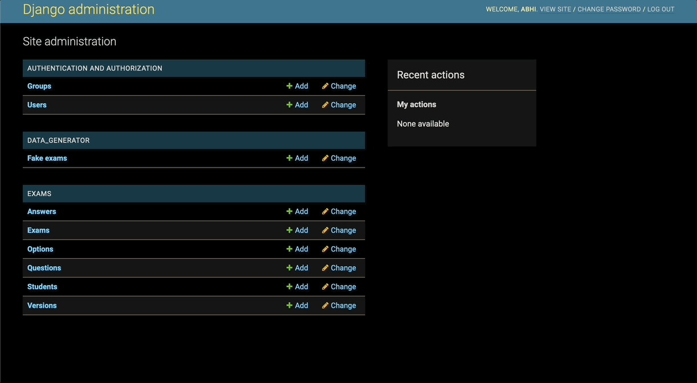
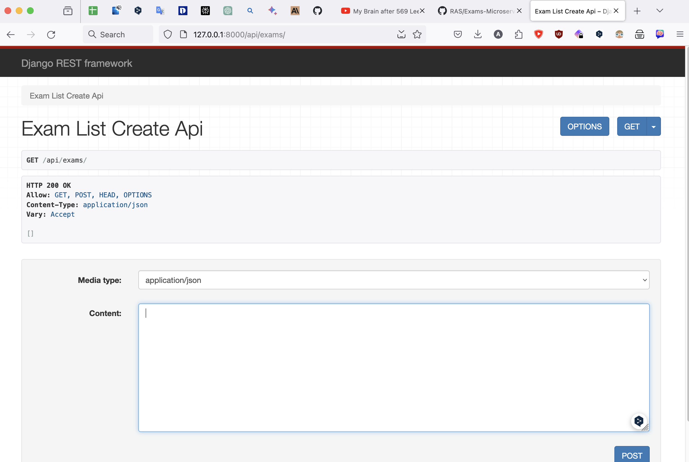
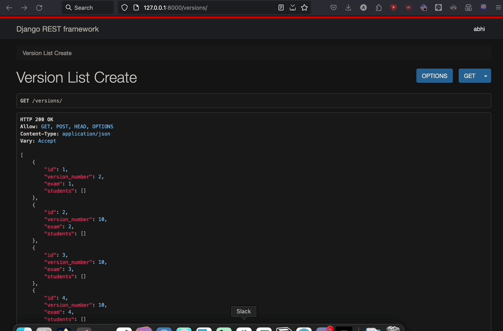

Set Up a Virtual Environment

```
# Create a virtual environment (optional but recommended)
python -m venv myenv
# Activate the virtual environment
# On Windows:
myenv\Scripts\activate
# On macOS/Linux:
source myenv/bin/activate
```

Install the Dependencies

```
pip install -r requirements.txt
```

Apply the Database Migrations

```
python manage.py migrate
```

Generate Fake Data

To generate fake data for frontend testing, run the following command:

```
python manage.py create_fake_data
```



Run the Development Server

```
python manage.py runserver
```

The project will be available at \*\*



API endpoints:

1. **Exams:**

   - List and Create Exams: `GET /exams/`
   - Retrieve, Update, and Destroy Exam: `GET /exams/<int:pk>/`

2. **Versions:**

   - List and Create Versions: `GET /versions/`
   - Retrieve, Update, and Destroy Version: `GET /versions/<int:pk>/`

3. **Questions:**

   - List and Create Questions: `GET /questions/`
   - Retrieve, Update, and Destroy Question: `GET /questions/<int:pk>/`

4. **Options:**

   - List and Create Options: `GET /options/`
   - Retrieve, Update, and Destroy Option: `GET /options/<int:pk>/`

5. **Answers:**

   - List and Create Answers: `GET /answers/`
   - Retrieve, Update, and Destroy Answer: `GET /answers/<int:pk>/`

6. **Students:**
   - List and Create Students: `GET /students/`
   - Retrieve, Update, and Destroy Student: `GET /students/<int:pk>/`


